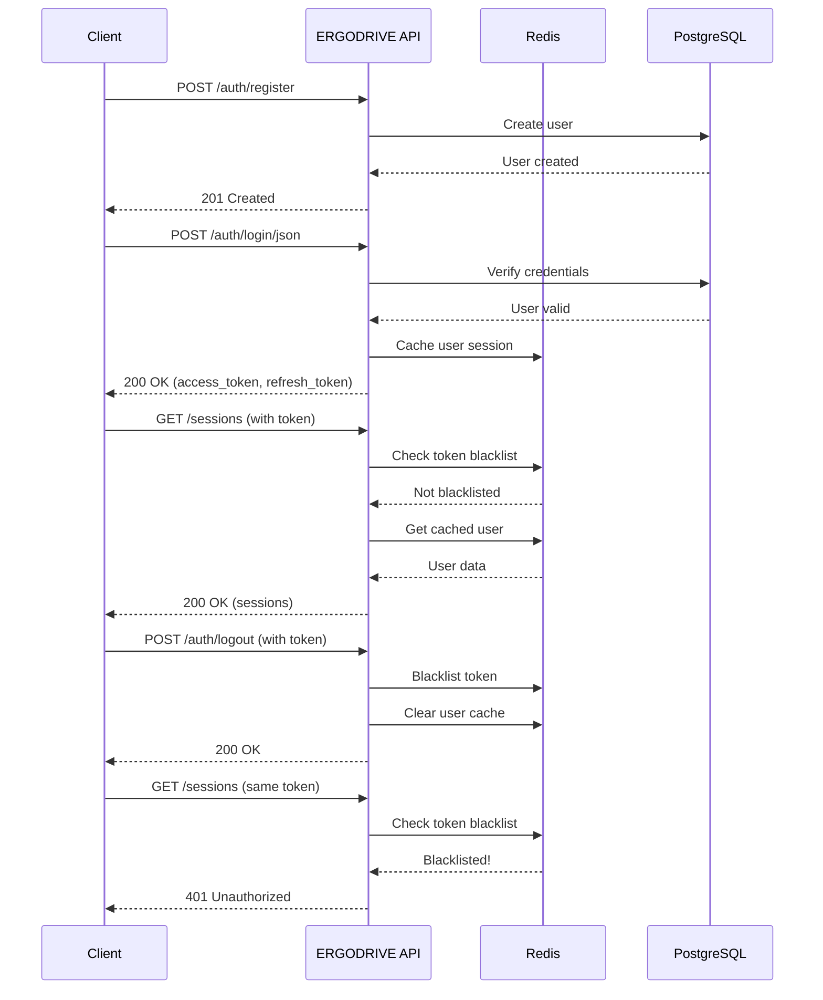

# ERGODRIVE API Usage Guide

**Complete reference for ERGODRIVE Backend API**

---

## 📚 Table of Contents
1. [Overview](#overview)
2. [Authentication Flow](#authentication-flow)
3. [API Endpoints](#api-endpoints)
4. [Code Examples](#code-examples)
5. [Error Handling](#error-handling)

---

## Overview

### Base URL
```
http://localhost:8000
```

### API Version
```
/api/v1
```

### Documentation
- **Swagger UI**: http://localhost:8000/api/docs
- **ReDoc**: http://localhost:8000/api/redoc

### Authentication
- Type: **JWT Bearer Token**
- Header: `Authorization: Bearer <token>`

---

## Authentication Flow



---

## API Endpoints

### Health & Info

#### Get API Status
```http
GET /
```

**Response:**
```json
{
  "name": "ERGODRIVE Backend API",
  "version": "1.0.0",
  "status": "running",
  "docs": "/api/docs"
}
```

#### Health Check
```http
GET /health
```

**Response:**
```json
{
  "status": "healthy",
  "service": "ergodrive-backend",
  "redis": {
    "status": "connected",
    "redis_version": "7.2.4"
  },
  "cache": {
    "cached_users": 5,
    "blacklisted_tokens": 2
  }
}
```

---

### Authentication

#### Register User
```http
POST /api/v1/auth/register
Content-Type: application/json

{
  "email": "user@example.com",
  "password": "SecurePass123",
  "full_name": "John Doe",
  "role": "student"
}
```

**Response (201 Created):**
```json
{
  "id": "uuid-here",
  "email": "user@example.com",
  "full_name": "John Doe",
  "role": "student",
  "is_active": true,
  "created_at": "2026-01-19T10:00:00Z"
}
```

#### Login
```http
POST /api/v1/auth/login/json
Content-Type: application/json

{
  "email": "user@example.com",
  "password": "SecurePass123"
}
```

**Response (200 OK):**
```json
{
  "access_token": "eyJhbGciOiJIUzI1NiIsInR5cCI6IkpXVCJ9...",
  "refresh_token": "eyJhbGciOiJIUzI1NiIsInR5cCI6IkpXVCJ9...",
  "token_type": "bearer"
}
```

#### Refresh Token
```http
POST /api/v1/auth/refresh
Content-Type: application/json

{
  "refresh_token": "your-refresh-token"
}
```

#### Logout
```http
POST /api/v1/auth/logout
Authorization: Bearer <access-token>
```

---

### Session Management

#### Create Session
```http
POST /api/v1/sessions
Authorization: Bearer <token>
Content-Type: application/json

{
  "session_name": "Morning Drive Test",
  "device_type": "Muse 2",
  "settings": {
    "difficulty": "medium",
    "weather": "clear"
  }
}
```

#### List Sessions
```http
GET /api/v1/sessions?page=1&page_size=20&status=active
Authorization: Bearer <token>
```

**Query Parameters:**
- `page` (default: 1)
- `page_size` (default: 20)
- `status` (optional): `active`, `completed`, `failed`

#### Get Session Details
```http
GET /api/v1/sessions/{session_id}
Authorization: Bearer <token>
```

#### Update Session
```http
PATCH /api/v1/sessions/{session_id}
Authorization: Bearer <token>
Content-Type: application/json

{
  "session_name": "Updated Name"
}
```

#### Complete Session
```http
POST /api/v1/sessions/{session_id}/complete
Authorization: Bearer <token>
```

#### Delete Session
```http
DELETE /api/v1/sessions/{session_id}
Authorization: Bearer <token>
```

---

## Code Examples

### cURL

**Register:**
```bash
curl -X POST http://localhost:8000/api/v1/auth/register \
  -H "Content-Type: application/json" \
  -d '{
    "email": "test@example.com",
    "password": "Test1234",
    "full_name": "Test User",
    "role": "student"
  }'
```

**Login:**
```bash
curl -X POST http://localhost:8000/api/v1/auth/login/json \
  -H "Content-Type: application/json" \
  -d '{
    "email": "test@example.com",
    "password": "Test1234"
  }'
```

**List Sessions:**
```bash
curl http://localhost:8000/api/v1/sessions \
  -H "Authorization: Bearer YOUR_TOKEN_HERE"
```

### Python (requests)

```python
import requests

BASE_URL = "http://localhost:8000"

# Register
response = requests.post(
    f"{BASE_URL}/api/v1/auth/register",
    json={
        "email": "test@example.com",
        "password": "Test1234",
        "full_name": "Test User",
        "role": "student"
    }
)
print(response.json())

# Login
response = requests.post(
    f"{BASE_URL}/api/v1/auth/login/json",
    json={
        "email": "test@example.com",
        "password": "Test1234"
    }
)
tokens = response.json()
access_token = tokens['access_token']

# List sessions (authenticated)
headers = {"Authorization": f"Bearer {access_token}"}
response = requests.get(f"{BASE_URL}/api/v1/sessions", headers=headers)
sessions = response.json()
print(sessions)
```

### JavaScript (fetch)

```javascript
const BASE_URL = "http://localhost:8000";

// Login
const login = async () => {
  const response = await fetch(`${BASE_URL}/api/v1/auth/login/json`, {
    method: "POST",
    headers: { "Content-Type": "application/json" },
    body: JSON.stringify({
      email: "test@example.com",
      password: "Test1234"
    })
  });
  
  const tokens = await response.json();
  return tokens.access_token;
};

// List sessions
const getSessions = async (token) => {
  const response = await fetch(`${BASE_URL}/api/v1/sessions`, {
    headers: { "Authorization": `Bearer ${token}` }
  });
  
  return await response.json();
};

// Usage
const token = await login();
const sessions = await getSessions(token);
console.log(sessions);
```

---

## Error Handling

### Common HTTP Status Codes

| Code | Meaning | Example |
|------|---------|---------|
| 200 | OK | Successful request |
| 201 | Created | Resource created successfully |
| 400 | Bad Request | Invalid request data |
| 401 | Unauthorized | Invalid or missing token |
| 403 | Forbidden | Insufficient permissions |
| 404 | Not Found | Resource not found |
| 422 | Validation Error | Request data didn't pass validation |
| 500 | Internal Server Error | Server error |

### Error Response Format

```json
{
  "detail": "Error message describing what went wrong"
}
```

### Validation Error Example (422)

```json
{
  "detail": [
    {
      "loc": ["body", "email"],
      "msg": "value is not a valid email address",
      "type": "value_error.email"
    },
    {
      "loc": ["body", "password"],
      "msg": "ensure this value has at least 8 characters",
      "type": "value_error.any_str.min_length"
    }
  ]
}
```

---

## Response Headers

All responses include custom headers:

```
X-Request-ID: abc12345        # Unique request identifier
X-Process-Time: 0.042         # Processing time in seconds
```

**Use for debugging and performance monitoring!**

---

## Rate Limiting

Currently: **No rate limiting** (development)

For production, consider implementing rate limiting based on:
- IP address
- User ID
- API key

---

## Best Practices

### 1. Token Management
```javascript
// Store tokens securely
localStorage.setItem("access_token", token);

// Always check token expiration
if (isTokenExpired(token)) {
  // Refresh token
  await refreshToken();
}

// Clear on logout
localStorage.removeItem("access_token");
```

### 2. Error Handling
```javascript
try {
  const response = await fetch(url, options);
  
  if (!response.ok) {
    const error = await response.json();
    console.error(`Error ${response.status}:`, error.detail);
  }
  
  return await response.json();
} catch (error) {
  console.error("Network error:", error);
}
```

### 3. Retry Logic
```javascript
const fetchWithRetry = async (url, options, retries = 3) => {
  for (let i = 0; i < retries; i++) {
    try {
      const response = await fetch(url, options);
      if (response.ok) return response;
    } catch (error) {
      if (i === retries - 1) throw error;
      await new Promise(r => setTimeout(r, 1000 * (i + 1))); // Exponential backoff
    }
  }
};
```

---

## WebSocket (Real-time Data)

Coming soon! WebSocket endpoints for:
- Real-time EEG data streaming
- Live session monitoring
- Fatigue alerts

See WebSocket documentation (coming in Week 3).

---

**Need Help?**
- Check [Swagger UI](http://localhost:8000/api/docs) for interactive testing
- See [POSTMAN_GUIDE.md](./POSTMAN_GUIDE.md) for Postman testing
- Review logs in terminal for debugging

**Last Updated**: 19 Januari 2026
