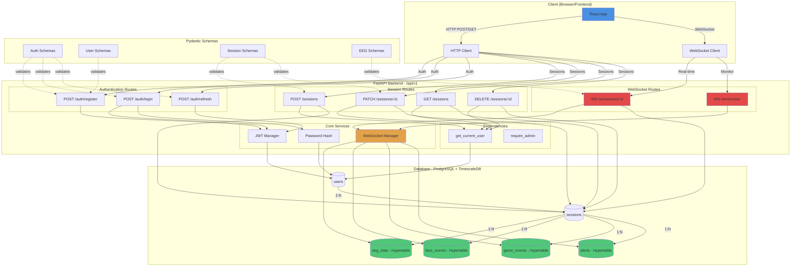

# System Architecture - Week 2 Tuesday Implementation

## Components Overview

### 1. Client Layer
- **React App**: Main frontend application
- **HTTP Client**: REST API calls for CRUD operations
- **WebSocket Client**: Real-time bidirectional communication

### 2. API Routes Layer (`/api/v1`)

#### Authentication Routes
- `POST /auth/register`: User registration
- `POST /auth/login`: OAuth2 login
- `POST /auth/refresh`: Token refresh

#### Session Routes
- `POST /sessions`: Create session
- `GET /sessions`: List sessions (paginated)
- `PATCH /sessions/:id`: Update session
- `DELETE /sessions/:id`: Delete session

#### WebSocket Routes
- `WS /ws/session/:id`: Session-specific streaming
- `WS /ws/monitor`: Global monitoring

### 3. Core Services
- **JWT Manager**: Token creation & verification
- **Password Hash**: Bcrypt password hashing
- **WebSocket Manager**: Connection lifecycle & broadcasting

### 4. Security & Dependencies
- **get_current_user**: Extract authenticated user from JWT
- **require_admin**: Role-based access control

### 5. Database Layer (PostgreSQL + TimescaleDB)
- **users**: User accounts
- **sessions**: Driving sessions
- **eeg_data**: Time-series EEG measurements (Hypertable)
- **face_events**: Face detection events (Hypertable)
- **game_events**: Game events (Hypertable)
- **alerts**: Fatigue alerts (Hypertable)

### 6. Data Validation (Pydantic Schemas)
- **Auth Schemas**: Token, Login, Register
- **User Schemas**: UserCreate, UserUpdate, UserResponse
- **Session Schemas**: SessionCreate, SessionUpdate, SessionResponse
- **EEG Schemas**: EEGDataPoint, FaceDetectionData, AlertData

## Data Flow

### Authentication Flow
1. Client sends credentials to `/auth/login`
2. Backend validates with Password Hash
3. JWT Manager creates access + refresh tokens
4. Tokens stored in database (users table)
5. Client receives tokens for future requests

### Session Management Flow
1. Client creates session via `/sessions`
2. Pydantic validates request data
3. Dependency extracts user from JWT token
4. Session stored in database
5. Response sent back with session ID

### Real-time Streaming Flow
1. Client connects to WebSocket `/ws/session/:id`
2. WebSocket Manager accepts connection
3. Client sends EEG/face/game data
4. Data validated and stored in TimescaleDB
5. Data broadcast to all session clients
6. Database persists for later analysis

## Security Layers

1. **JWT Authentication**: All protected routes require valid access token
2. **Password Hashing**: Bcrypt with automatic salt generation
3. **Role-Based Access**: Admin, Researcher, Student roles
4. **CORS Protection**: Configured allowed origins
5. **Input Validation**: Pydantic schemas validate all inputs
6. **SQL Injection Prevention**: SQLAlchemy ORM

## Performance Optimizations

1. **Batch EEG Insertion**: Multiple data points inserted in single transaction
2. **TimescaleDB Hypertables**: Optimized for time-series data
3. **WebSocket Connection Pooling**: Multiple clients per session
4. **Dead Connection Cleanup**: Automatic removal of disconnected clients
5. **Async Operations**: FastAPI async/await for concurrent requests

## Scalability Considerations

- Ready for Redis caching (session data, token blacklist)
- WebSocket manager supports multiple concurrent sessions
- Database indexing on critical fields (user_id, timestamp)
- Pagination for large dataset queries
- Automatic hypertable chunking (TimescaleDB)

---

**Status**: ✅ COMPLETE
**Next**: Week 2 Wednesday - Frontend State Management
